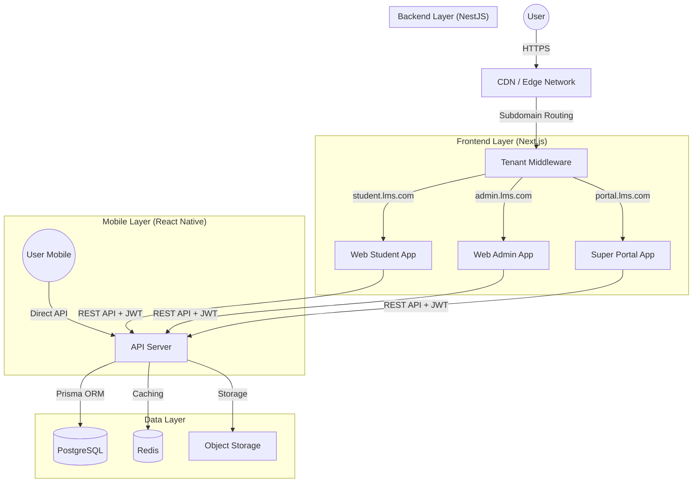

# Tổng Quan Kiến Trúc (Architecture Overview)

LMS Platform được xây dựng trên **Kiến trúc Monorepo** sử dụng Turborepo, tối đa hóa việc chia sẻ mã nguồn (code sharing) và đảm bảo tính an toàn kiểu dữ liệu (type safety) trên toàn bộ hệ thống.

## Mục Lục

- [Kiến trúc Tầng cao (High-Level Architecture)](#kiến-trúc-tầng-cao-high-level-architecture)
- [Các Nguyên Tắc Cốt Lõi (Core Principles)](#các-nguyên-tắc-cốt-lõi-core-principles)
- [Lý do về Cấu trúc Thư mục](#lý-do-về-cấu-trúc-thư-mục)

## Kiến trúc Tầng cao (High-Level Architecture)

## Các Nguyên Tắc Cốt Lõi (Core Principles)

### 1. Multi-Tenancy (Đa khách thuê)

- **Chiến lược**: Database-per-tenant (mỗi khách một DB) quá tốn kém cho 1 triệu user. Chúng ta sử dụng **Schema-based Multi-tenancy** (Dùng chung Database, phân biệt bằng cột `tenantId`).
- **Triển khai**: Mọi bảng (trừ các bảng config global) đều có cột `tenantId`.
- **Cô lập**: `TenantMiddleware` trong NestJS sẽ tự động lọc các truy vấn theo `tenantId` (Sử dụng Prisma Middleware/Extensions).

### 2. Single Codebase (Một bộ mã duy nhất)

- Tất cả các tenants đều chạy chính xác cùng một phiên bản code.
- Các bản cập nhật được deploy một lần và áp dụng ngay lập tức cho tất cả tenants.
- Việc tùy chỉnh (Customization) được xử lý thông qua Feature Flags và Tenant Settings (lưu trong DB dưới dạng JSON), không phải bằng cách rẽ nhánh code (branching).

### 3. Scalability (Khả năng mở rộng)

- **Stateless Backend**: API Server hoàn toàn stateless, cho phép mở rộng theo chiều ngang (horizontal scaling) phía sau Load Balancer.
- **Frontend Edge**: Các ứng dụng Next.js được tối ưu hóa cho việc deploy trên Vercel/Edge.
- **Database**: PostgreSQL với connection pooling (ví dụ: PgBouncer) và có thể sử dụng read-replicas.

## Lý do về Cấu trúc Thư mục

- **`apps/`**: Các ứng dụng có thể deploy. Việc tách biệt Student và Admin apps cho phép bundle size nhỏ hơn và các chính sách bảo mật riêng biệt.
- **`packages/database`**: Nguồn chân lý duy nhất (Single source of truth). Ngăn chặn việc sai lệch schema giữa backend và frontend types.
- **`packages/shared`**: Đảm bảo các DTOs được sử dụng trong API Controllers khớp chính xác với các types được gọi ở Frontend API.
