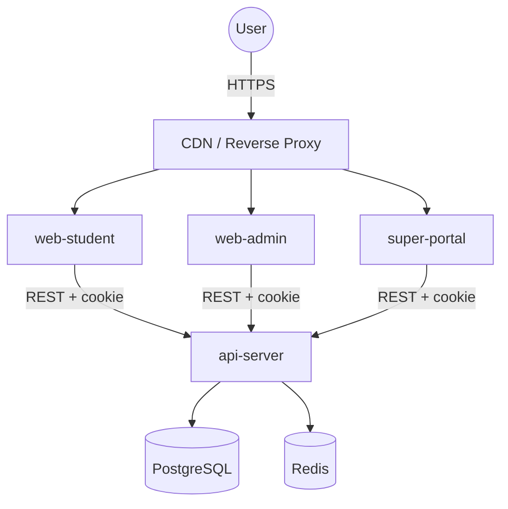

# Tổng Quan Kiến Trúc (Architecture Overview)

LMS Platform là monorepo multi-tenant dùng pnpm + Turborepo, với backend NestJS và ba frontend Next.js riêng cho student, admin và super portal.

## Mục Lục

- [Kiến trúc Tầng cao](#kiến-trúc-tầng-cao)
- [Nguyên Tắc Cốt Lõi](#nguyên-tắc-cốt-lõi)
- [Boundary Hiện Tại](#boundary-hiện-tại)
- [Learning Domain Hiện Tại](#learning-domain-hiện-tại)
- [Tenant Và Runtime Policy](#tenant-và-runtime-policy)

## Kiến trúc Tầng cao

## Nguyên Tắc Cốt Lõi

### 1. Multi-Tenancy

- Dùng shared database + tenant scoping theo `tenantId`.
- Mọi read/write tenant-scoped phải có tenant context ở service layer hoặc policy service.
- Production resolve tenant từ host/domain/origin đáng tin cậy.
- `x-tenant-id` chỉ nên dùng cho local/dev hoặc deployment đã chủ động tin cậy.

### 2. Single Codebase

- Tất cả tenant dùng cùng một codebase.
- Tùy biến tenant đi qua DB settings, feature flags, hoặc dữ liệu tenant.
- Không rẽ nhánh logic theo tenant trong frontend khi có thể gom vào API/policy.

### 3. Cookie-First Browser Auth

- Browser session dùng `HttpOnly` `access_token`.
- State-changing requests dùng CSRF double-submit cookie/header.
- Frontend không dùng `localStorage` làm authority cho JWT.

### 4. Stateless Backend

- API server stateless để dễ scale ngang.
- PostgreSQL là source of truth.
- Redis dùng cho throttling/readiness/runtime support.

## Boundary Hiện Tại

### Apps

- `apps/api-server`: NestJS REST API.
- `apps/web-student`: trải nghiệm học viên.
- `apps/web-admin`: quản trị trung tâm.
- `apps/super-portal`: quản trị platform/tenant.

### Shared packages

- `@repo/database`: Prisma schema, migrations, seed, generated client.
- `@repo/api-client`: Axios client shared cho browser auth, CSRF, 401 handling.
- `@repo/shared`: constants, auth store, security helpers, CSP.
- `@repo/ui`: shared UI primitives.

### Backend modules chính

- `auth`
- `user`
- `admin`
- `course`
- `lesson`
- `progress`
- `practice`
- `exam`
- `srs`
- `roleplay`
- `media`
- `admin-reports`
- `health`
- `metrics`
- `mcp`

## Learning Domain Hiện Tại (Đang dịch chuyển)

Luồng nội dung học tập hiện tại đi theo mô hình course-first:
`Course -> CourseUnit -> CourseActivity -> target`.
**Tầm nhìn tương lai:** Sẽ dịch chuyển sang mô hình "Adaptive Skill Tree" nơi AI lắp ráp lộ trình cá nhân hóa từ các "Micro-Cards" thay vì bài giảng dài tĩnh.

- `Course` là khối chính để enrollment, progress, practice, exam bám vào.
- `CourseUnit` là unit/chapter thuộc `Course`, dùng để nhóm curriculum.
- `CourseActivity` là item trong lộ trình khóa học, trỏ đến `Lesson`, `PracticeExerciseSet`, `Exam` hoặc `RoleplayScenario`.
- `UserCourseActivityProgress` lưu trạng thái activity-level để practice/exam cũng có progress trong lộ trình.
- `Lesson` vẫn giữ `courseId`, `unitId`, `practiceExerciseSetId`, `examId` để backward compatibility trong giai đoạn chuyển đổi.
- Course detail API trả cả `units` grouped và `lessons` phẳng để các màn hình cũ tiếp tục chạy.
- Course activity API (`GET /api/courses/:id/activities`) là contract ưu tiên cho student course detail mới.

### Practice

- `PracticeQuestion` là question bank theo tenant/course/unit.
- `PracticeExerciseSet` nhóm câu hỏi theo course/unit và chỉ publish mới hiển thị cho student.
- `PracticeAttempt` và `PracticeAnswer` lưu snapshot, điểm số và feedback.
- Student read không trả `correctAnswer`/`explanation` trước khi submit.
- AI-generated practice dùng job/draft/review trail. Draft chỉ trở thành `PracticeQuestion` student-visible sau khi admin/instructor approve.

### Exam

- `Exam` là template theo tenant/course/unit.
- `ExamSection` và `ExamQuestion` mô tả cấu trúc đề.
- `ExamAttempt` và `ExamAnswer` lưu lifecycle `STARTED`/`SUBMITTED`, score, snapshot và review.
- Timer enforcement dựa trên `startedAt + durationMinutes`.

### Reporting

- Student summary trả activity calendar, continue lesson, streak và performance theo unit/skill.
- Course report trả enrollment progress, completion rate, activity sessions và tracked time.
- Admin overview có activity trend 7 ngày và accuracy tổng hợp từ practice/exam attempts.
- Admin Reporting V2 có `StudentRiskSnapshot` và `ReportingRiskRule` cho risk flags theo tenant, cộng endpoint cohort comparison theo completion, activity, assessment accuracy, mastery và overdue SRS.

### Microlearning Và SRS

- `LessonType.micro_card` vẫn lưu nội dung trong `Lesson.content` để tương thích, nhưng content được parse/validate bằng shared parser `@repo/shared/learning/micro-card`.
- Student micro-card player ghi `LearningActivityType.MICRO_CARD_VIEWED`, `MICRO_CARD_FLIPPED`, `MICRO_CARD_COMPLETED`.
- Học viên có thể lưu từng micro-card vào `ReviewCardSource.CUSTOM` để đưa vào SRS queue.

### Roleplay Và Pronunciation

- `RoleplayScenario` là kịch bản hội thoại thuộc tenant/course/unit, có `mode` (`TEXT`, `AUDIO`, `MIXED`), prompt, rubric và trạng thái publish.
- Student chỉ nhìn thấy published scenarios từ các course có quyền học qua `LearningAccessService`.
- `RoleplaySession` giữ compatibility với legacy free-text scenario, nhưng session mới có thể liên kết `scenarioId`.
- Audio turn dùng `MediaAsset` đã upload, tạo `RoleplayMessage` và `PronunciationAssessment`.
- Pronunciation scoring đi qua `PronunciationAssessmentProvider` và BullMQ queue `pronunciation-assessment`; provider mặc định fail rõ ràng ngoài test cho tới khi production provider được cấu hình.

## Mô Hình Học Tập Lai (Hybrid AI-Enhanced Learning)

Kiến trúc hệ thống được thiết kế để kết hợp hài hòa giữa phương pháp học truyền thống và sức mạnh của AI, tối ưu cho đào tạo ngôn ngữ, luyện thi và kỹ năng nhưng vẫn giữ tính đa ngành:

- **Traditional Core (Tĩnh)**: Duy trì các cột trụ vững chắc như Video bài giảng, Flashcards (`micro_card`), Trắc nghiệm (`quiz`) và Đề thi chuẩn hóa (`exam`).
- **AI-Enhanced Layers (Động)**:
  - **Contextual AI Tutor**: Bảng `Course` chứa `aiSettings` JSON để config Prompt. AI hiểu nội dung bài học để giải thích ngữ pháp, từ vựng ngay khi học viên cần.
  - **Experiential Simulations**: Bảng `Lesson` mở rộng với `type=simulation` và field `aiPrompt`. Học viên đóng vai hội thoại với AI để thực hành giao tiếp thực tế.
  - **Course Roleplay Scenarios**: Admin tạo/publish kịch bản hội thoại theo course/unit; student practice bằng text hoặc audio và nhận pronunciation assessment async.
  - **Multi-modal Assignments**: Practice và Exam support các câu hỏi dạng `AI_EVALUATED_AUDIO` và `AI_EVALUATED_TEXT`. AI (vd: Gemini Multimodal) chấm điểm và trả về `aiFeedback` chi tiết.

## Tenant Và Runtime Policy

- `NEXT_PUBLIC_TENANT_ID` là tenant hint local/dev, không phải cơ chế production.
- Production browser traffic nên resolve tenant từ host/subdomain.
- `CORS_ORIGINS` phải là exact origin list.
- `TRUST_PROXY` chỉ bật khi đứng sau reverse proxy đáng tin cậy.
- `ALLOW_TENANT_HEADER_IN_PRODUCTION` nên để `false` trừ khi edge chủ động inject header.
- `APP_PUBLIC_URL` nên trỏ tới URL API public để log/runbook/smoke không bị mơ hồ.

## Quy Tắc Khi Mở Rộng

- Mỗi read/write student-facing phải check tenant và enrollment/license phù hợp.
- Không duplicate enrollment predicates ở nhiều service; dùng policy service chung.
- Feature lớn phải đi cùng migration, tests, docs và verify flow.
- Docs architecture/backlog phải cập nhật cùng PR khi domain thay đổi.
