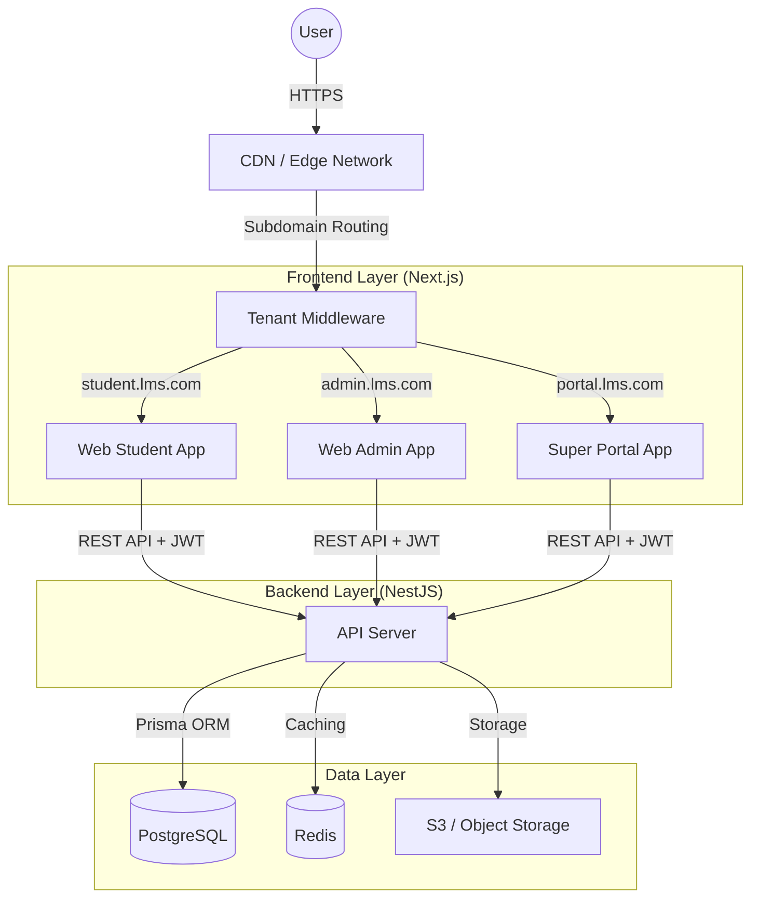

# Tổng Quan Kiến Trúc (Architecture Overview)

LMS Platform được xây dựng trên **Kiến trúc Monorepo** sử dụng Turborepo, tối đa hóa việc chia sẻ mã nguồn (code sharing) và đảm bảo tính an toàn kiểu dữ liệu (type safety) trên toàn bộ hệ thống.

## Mục Lục

- [Kiến trúc Tầng cao (High-Level Architecture)](#kiến-trúc-tầng-cao-high-level-architecture)
- [Các Nguyên Tắc Cốt Lõi (Core Principles)](#các-nguyên-tắc-cốt-lõi-core-principles)
- [Lý do về Cấu trúc Thư mục](#lý-do-về-cấu-trúc-thư-mục)

## Kiến trúc Tầng cao (High-Level Architecture)

## Các Nguyên Tắc Cốt Lõi (Core Principles)

### 1. Multi-Tenancy (Đa khách thuê)

- **Chiến lược**: Database-per-tenant (mỗi khách một DB) quá tốn kém cho 1 triệu user. Chúng ta dùng **shared database + row-level tenant scoping**: cùng một database, phân biệt dữ liệu bằng cột `tenantId`.
- **Triển khai**: Mọi bảng (trừ các bảng config global) đều có cột `tenantId`.
- **Cô lập**: `TenantMiddleware` resolve tenant context từ host/header. Service layer và database constraints mới là nơi thực thi tenant scoping cho từng query.

### 2. Single Codebase (Một bộ mã duy nhất)

- Tất cả các tenants đều chạy chính xác cùng một phiên bản code.
- Các bản cập nhật được deploy một lần và áp dụng ngay lập tức cho tất cả tenants.
- Việc tùy chỉnh (Customization) được xử lý thông qua Feature Flags và Tenant Settings (lưu trong DB dưới dạng JSON), không phải bằng cách rẽ nhánh code (branching).

### 3. Scalability (Khả năng mở rộng)

- **Stateless Backend**: API Server hoàn toàn stateless, cho phép mở rộng theo chiều ngang (horizontal scaling) phía sau Load Balancer.
- **Frontend Edge**: Các ứng dụng Next.js được tối ưu hóa cho việc deploy trên Vercel/Edge.
- **Database**: PostgreSQL với connection pooling (ví dụ: PgBouncer) và có thể sử dụng read-replicas.

## Lý do về Cấu trúc Thư mục

- **`apps/`**: Các ứng dụng có thể deploy. Việc tách biệt Student, Admin và Super Portal apps cho phép bundle size nhỏ hơn và các chính sách bảo mật riêng biệt.
- **`packages/database`**: Nguồn chân lý duy nhất (Single source of truth) cho schema và types. Ngăn chặn việc sai lệch schema giữa backend và frontend types.
- **`packages/shared`**: Đảm bảo các DTOs được sử dụng trong API Controllers khớp chính xác với các types được gọi ở Frontend.
- **`packages/api-client`**: Shared axios instance với interceptors cho authentication và response handling, tránh duplicate code giữa các apps.
- **`packages/ui`**: Shared components (shadcn/ui) được dùng chung cho tất cả frontend apps.

## Learning Domain Hiện Tại

Luồng nội dung học tập chính hiện là `Course -> CourseUnit -> Lesson`.

- `Course` là khóa/book chính để enrollment và entitlement bám vào.
- `CourseUnit` là unit/chapter trong course, dùng để nhóm curriculum và là điểm neo cho practice/reporting theo unit về sau.
- `Lesson` vẫn giữ `courseId` để backward compatibility và access check nhanh, đồng thời có `unitId` nullable để migrate dữ liệu cũ an toàn.
- Course detail API trả cả `units` grouped và `lessons` phẳng; frontend mới nên ưu tiên `units`, còn `lessons` phẳng dùng cho continue/next-prev compatibility.

Practice domain đã tách khỏi `Lesson.quiz`:

- `PracticeQuestion` là question bank theo tenant/course/unit, hỗ trợ MVP `MULTIPLE_CHOICE` và `FILL_BLANK`.
- `PracticeExerciseSet` nhóm question theo course/unit và chỉ publish mới hiển thị cho student.
- `PracticeAttempt` và `PracticeAnswer` lưu snapshot bài làm, điểm số và feedback để làm reporting theo unit/skill về sau.
- Student practice APIs đi qua `LearningAccessService`, nên vẫn bị giới hạn bởi enrollment course hợp lệ.
- Student practice reads không trả `correctAnswer` hoặc `explanation` trước khi submit; feedback chỉ trả trong kết quả attempt.
- Student app hiện có recent attempts và route review riêng cho `PracticeAttempt`, nên flow luyện tập không còn phụ thuộc vào state tạm ở client.

Exam domain cũng đã tách khỏi `Lesson.quiz`:

- `Exam` là template theo tenant/course/unit, chỉ publish mới hiển thị cho student.
- `ExamSection` và `ExamQuestion` lưu cấu trúc đề, hỗ trợ MVP `MULTIPLE_CHOICE` và `FILL_BLANK`.
- `ExamAttempt` và `ExamAnswer` lưu lifecycle `STARTED`/`SUBMITTED`, score, answer snapshot và review result.
- Admin app quản lý exam template qua route `/exams`; student app làm bài và review kết quả qua route `/exams`.
- Student exam APIs đi qua `LearningAccessService`, nên vẫn bị giới hạn bởi enrollment course hợp lệ.
- Student exam reads không trả `correctAnswer` hoặc `explanation` trước khi submit.
- Timer enforcement hiện được tính từ `startedAt + durationMinutes`; submit quá hạn bị reject và start attempt sẽ resume attempt `STARTED` còn hạn.
- Student app có recent attempts, route review riêng cho `ExamAttempt`, và link resume cho attempt `STARTED` còn hạn.
