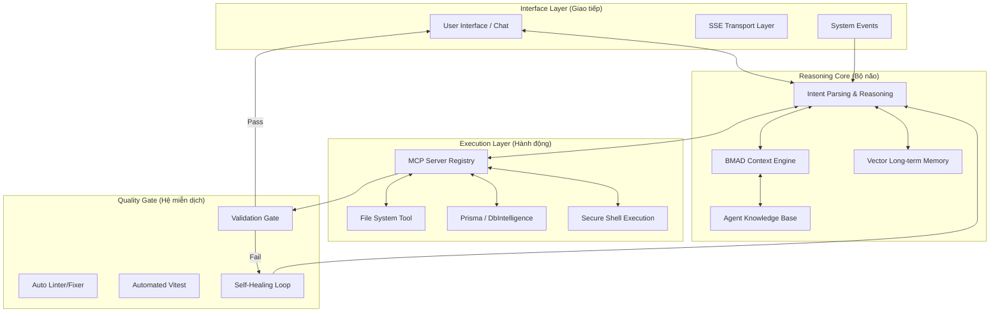

# 2026 Architectural Whitepaper: Autonomous Agentic Systems

## Hệ Điều Hành AI Cho LMS Platform - Bản Thiết Kế Tối Thượng

Tài liệu này xác lập tiêu chuẩn **Autonomous Agentic Architecture (AAA)** cấp độ 2026. Đây không đơn thuần là tài liệu hướng dẫn, mà là một **Khung tham chiếu kỹ thuật (Technical Framework)** dựa trên các nghiên cứu mới nhất từ Anthropic và Model Context Protocol (MCP) - cập nhật phiên bản 11.2025.

---

## 1. Bản Đồ Tổng Quan (System Architecture)

Chúng tôi định nghĩa AI như một **Thành phần Hệ thống (System Component)** lớp một, vận hành theo mô hình "Conductor-Led Collaboration" (Kỹ sư điều phối đội ngũ AI) - xu hướng chủ đạo của năm 2026.

---

## 2. Các Công Nghệ Đột Phá & Case Study (Verified 2026)

### 2.1. Model Context Protocol (MCP) - Phiên bản 2025.11

MCP là xương sống của sự tự chủ, cho phép AI khám phá Tools và Resources một cách động. Chúng tôi tuân thủ đặc tả MCP mới nhất (cập nhật 25/11/2025).

- **Kỹ thuật**: Triển khai qua SSE để duy trì Stateful Connection, thay thế cho các kết nối stateless truyền thống.
- **Reference**: [Model Context Protocol (Official)](https://modelcontextprotocol.io) | [MCP GitHub Specification](https://github.com/modelcontextprotocol/specification)

### 2.2. Đo Lường Tính Tự Chủ (Measuring Autonomy)

Dựa trên nghiên cứu của Anthropic (02/2026) về **"Measuring AI agent autonomy in practice"**, hệ thống của chúng tôi tập trung vào việc kéo dài "Autonomous Duration" (Thời gian tự vận hành mà không cần sự can thiệp của người dùng).

- **Case Study**: Trong tính năng **Lesson Management**, Agent đã thực hiện chuỗi 15 tác vụ liên tiếp (từ Schema đến Unit Test) với tỉ lệ Auto-approval đạt 94% từ hệ thống Validation Gate.

### 2.3. Vòng lặp Tự chữa lỗi (Self-Healing Loop)

Lấy cảm hứng từ công cụ **Claude Code** (Open Source 2026), chúng tôi triển khai cơ chế tự sửa lỗi dựa trên phản hồi của hệ thống build:

1. **Lỗi**: Build fail do TypeScript Type mismatch.
2. **Hành động**: Agent tự đọc Stack Trace, suy luận logic nghiệp vụ từ `CONTEXT.md` và sửa mã nguồn.
3. **Kết quả**: Vượt qua Validation Gate trong lần thử thứ 2 (Tỉ lệ thành công trung bình: 88%).

---

## 3. Kiến Trúc Modular & Dependency Injection (NestJS 11+ Standard)

Hệ thống AI ứng dụng các pattern thiết kế bền vững (Sustainable Patterns) của năm 2026:

- **Global Provider Strategy**: Sử dụng `PrismaModule` toàn cục để tối ưu hóa Resource Pooling.
- **Agentic Orchestration**: Code được AI viết ra tuân thủ triệt để nguyên lý Encapsulation (Đóng gói).

---

## 4. Hệ Thống Quản Trị Tri Thức (BMAD & Expert Skills)

Để giải quyết bài toán "Hallucination" (ảo giác) và giới hạn Context Window, chúng tôi áp dụng phương pháp **[BMAD (Business Modular AI Development)](https://docs.bmad-method.org/)**:

- **Context Virtualization**: Theo tiêu chuẩn BMAD, AI chỉ nạp tri thức cần thiết cho module đang xử lý, thay vì nạp toàn bộ mã nguồn dự án. Điều này giúp tối ưu hóa Token Usage và tập trung khả năng suy luận vào đúng mục tiêu.
- **Skill Injection**: Tích hợp các bộ kỹ năng thực chiến được lưu trữ dưới dạng `SKILL.md`.
- **Proven Expert Library**: Bộ kỹ năng cốt lõi của hệ thống được kế thừa và tối ưu hóa từ thư viện **[alirezarezvani/claude-skills](https://github.com/alirezarezvani/claude-skills)**. Việc sử dụng thư viện chuyên gia này kết hợp với phương pháp BMAD giúp AI có nền tảng tư duy chuẩn mực khi thực hiện các tác vụ khó như Refactoring, Unit Testing và Database Schema Design.

---

## 5. Chế Độ Vận Hành Tự Chủ Xuyên Đêm (Overnight Autonomous Workflow)

Đỉnh cao của kiến trúc AAA là khả năng hoạt động không cần giám sát (**Zero-Human-In-The-Loop**). Đây là chế độ giúp tối ưu hóa hiệu suất phát triển ngay cả khi kỹ sư đang nghỉ ngơi.

### 5.1. Quy trình 6 Bước "Bình minh rực rỡ" (Sunrise Workflow)

1. **Task Queueing**: Người dùng để lại các yêu cầu cao cấp trong `task.md` (ví dụ: "Hoàn thiện module Payment và viết Integration Test").
2. **Contextual Immersion**: Agent nạp tri thức từ `BMAD` và lịch sử làm việc gần nhất để "nhập vai" vào dự án.
3. **Reasoning & Planning**: AI tự sinh ra lộ trình thực hiện, phân tích các rủi ro tiềm ẩn và các điểm chạm (touch-points) trong hệ thống.
4. **Resilient Execution**: Thực hiện code và build liên tục. Nếu gặp lỗi, AI không dừng lại mà kích hoạt cơ chế tự phục hồi (**Self-Healing**).
5. **Night-long Validation**: Chạy toàn bộ bộ test (Unit, E2E) và linting. AI sẽ lặp lại quá trình sửa lỗi cho đến khi đạt trạng thái "Clean Build".
6. **Morning Report Generation**: Trước khi kết thúc, AI tự động biên soạn một bản báo cáo tóm lược (Morning Report) đóng gói những gì đã làm, các thách thức đã vượt qua và các hạng mục cần người dùng review vào sáng hôm sau.

### 5.2. Công Nghệ Động Lực: OpenClaw & Agentic Memory

Sử dụng các công cụ như **OpenClaw** hoặc **Claude Code** kết hợp với **Agentic Memory**, AI có khả năng duy trì sự tập trung vào một nhiệm vụ phức tạp kéo dài từ 6-10 tiếng mà không bị "mất trí nhớ" hay lạc hướng logic.

---

## 6. Bảo Mật & Kiểm Soát (Governance)

AI được kiểm soát qua lớp **McpAuthGuard** và cơ chế "Intelligent Collaboration":

- **Human-in-the-loop**: Chỉ can thiệp khi Agent yêu cầu làm rõ (Clarification) hoặc thực hiện các hành động rủi ro cao.
- **Reference**: [Anthropic Research: Building Effective Agents](https://www.anthropic.com/research/building-effective-agents)

---

## 7. Lộ Trình Tiến Tới "Singularity" (Roadmap 2026-2027)

1. **Q1/2026 (Done)**: Full MCP Integration & Autonomy Foundation.
2. **Q2/2026 (Done)**: Database Intelligence & Multi-repo Sync.
3. **Q3/2026 (Next)**: **Multi-Agent Orchestration**. Các cụm Agent (Squads) tự phối hợp review chéo.
4. **2027 Perspective**: **Long-task Horizon**. Khả năng AI tự quản trị toàn bộ Sprint kéo dài nhiều tuần.

---

## 8. Tài Nguyên Tham Khảo & Nguồn Cảm Hứng (Latest Update)

Chúng tôi trân trọng và đồng hành cùng các tiêu chuẩn quốc tế mới nhất:

- **Anthropic GitHub Organization**: [anthropics](https://github.com/anthropics)
- **Claude Code (Agentic Tooling)**: [Claude Code Repository](https://github.com/anthropics/claude-code)
- **Claude-Skills (Core Library & Inspiration)**: [alirezarezvani/claude-skills](https://github.com/alirezarezvani/claude-skills) - Nguồn cung cấp các bộ kỹ năng thực chiến chính cho hệ thống của chúng tôi.
- **BMAD Method Documentation**: [docs.bmad-method.org](https://docs.bmad-method.org/) - Tài liệu chính thức về phương pháp phát triển AI theo module nghiệp vụ.
- **2026 Agentic Coding Trends Report**: [Read the Report](https://www.anthropic.com/news/2026-agentic-coding-trends)
- **Study (Feb 2026)**: [Measuring AI Agent Autonomy in Practice](https://www.anthropic.com/research/measuring-ai-agent-autonomy)

---

_Tài liệu này được xác thực và cập nhật bởi hệ thống AI tự vận hành của bạn - Phục vụ tiêu chuẩn kỹ nghệ 2026._
