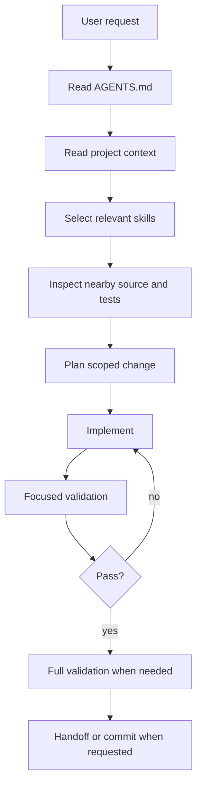

# AI Agent Operating Architecture

This document describes the practical AI-agent workflow for LMS Platform.
It is not a product architecture document. For system architecture, use `docs/ARCHITECTURE.md`.

## Goals

- Help humans and AI agents work from the same context.
- Reduce hallucination by routing agents to the smallest relevant knowledge set.
- Keep code changes safe through repeatable validation gates.
- Make handoff, review, commit, and push behavior predictable.

## File Map

| File or folder                            | Purpose                                                                            |
| ----------------------------------------- | ---------------------------------------------------------------------------------- |
| `AGENTS.md`                               | Root instruction entrypoint for AI coding agents                                   |
| `CLAUDE.md`                               | Claude Code project-memory entrypoint that points back to `AGENTS.md`              |
| `docs/ai-agent/SOP.md`                    | Standard operating procedure for intake, plan, implementation, validation, handoff |
| `agent-knowledge/lms-platform/CONTEXT.md` | Domain and business context                                                        |
| `agent-knowledge/lms-platform/SKILL.md`   | Skill routing index                                                                |
| `agent-knowledge/skills/*/SKILL.md`       | Task-specific working instructions                                                 |
| `scripts/validate-ai-work.ps1`            | Windows validation gate aligned with CI fast checks                                |

## Agent Workflow



## Context Loading Strategy

Agents should not load every document in the repo.
Use progressive context loading:

1. Always read `AGENTS.md`.
2. Read `agent-knowledge/lms-platform/CONTEXT.md` for domain context.
3. Pick only the relevant skill files.
4. Read nearby source files and tests.
5. Read docs only when they affect the task.

This keeps context precise and reduces accidental cross-module changes.

## Quality Gates

Focused checks are used while iterating:

```bash
pnpm --filter api-server test
pnpm --filter api-server typecheck
pnpm --filter @repo/ui typecheck
```

Final checks before handoff, commit, or push:

```bash
pnpm install --frozen-lockfile
pnpm run typecheck
pnpm run lint
pnpm run test
pnpm run build
```

Use `scripts/validate-ai-work.ps1` on Windows when a single command is preferred.

## Governance

Human approval is required before:

- Pushing commits.
- Running destructive database operations.
- Rewriting git history.
- Changing authentication, authorization, tenant isolation, or migration strategy.
- Removing data or tracked files unless the reason is explicit.

Agents should stop and report when a task requires a product decision, security tradeoff, public API break, or data migration risk.

## Current Maturity

The project has:

- A skill-based knowledge base.
- A root agent entrypoint.
- A clear SOP.
- CI-aligned validation commands.
- A documented handoff format.

The next improvement is better E2E coverage for `web-admin` and `super-portal`, then an optional agent task template for GitHub issues.
